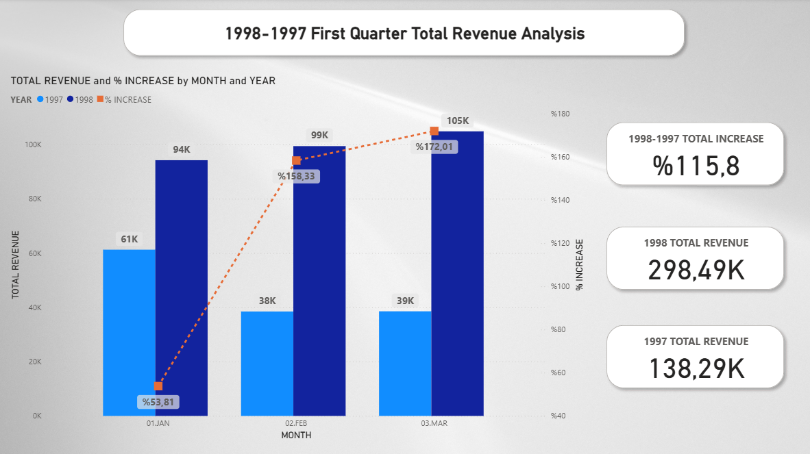

# 📊 Northwind Traders SQL + Power BI Analysis

Welcome to my end-to-end analysis project on the classic **Northwind database**. This project combines **SQL** for data extraction and transformation with **Power BI** for visualization and business insights.

---

## 🚀 Project Objectives

- Perform detailed analysis of sales performance, products, customers, employees, and shipments.
- Build a clean, interactive Power BI dashboard to communicate insights.
- Practice SQL data wrangling and Power BI data modeling.
- Simulate a real-world business case using a sample retail dataset.

---

## 🗃️ Data Source

- [Northwind Database for SQL Server](https://github.com/Microsoft/sql-server-samples/tree/master/samples/databases/northwind-pubs)
- Time range: July 1996 to May 1998
- ~8,000 order details, ~900 orders

---

## 📌 Key Insights

- 📈 **Revenue doubled** from Q1 1997 to Q1 1998 (+115.8%)
- 🛒 **Côte de Blaye** is the top-selling product
- 💼 Employee 'Margaret' leads sales with 18.3% avg monthly revenue share
- 🚚 91% of all shipments arrived on time; Federal Shipping performs best
- 👥 Top 33% of customers bring 76% of total revenue

[See Full Insights ➜](./Insights/final_insights_summary.md)

---

## 💻 Tools Used

- SQL Server
- Power BI
- DAX (basic)
- Git & GitHub

---

## 📷 Dashboard Preview

---

## 🧠 Lessons Learned

- Hands-on experience in transforming raw relational data into business insights
- Importance of date filtering for fair year-over-year comparisons
- Gained understanding in data storytelling and visual prioritization

---
Note:
This report was developed using a local SQL Server instance (eren\monster) and the NORTHWINDDB database for demonstration purposes.

The file is safe to open. The source has been anonymized where possible.

If you wish to refresh the data, you can either:
• Replace the server reference in Power Query with your own SQL Server instance
• Or create a local SQL Server named eren\monster and restore the NORTHWINDDB database
• Database restore file is located under Database folder. You can download the .bak file and restore the database on your server management studio.
• ===>> [.bak file](./Database/Northwind_Database.bak)

## 🤝 Let's Connect!

If you like this project, feel free to ⭐️ it or connect with me on [LinkedIn](https://www.linkedin.com/in/eren-arslan-848646231/)!

